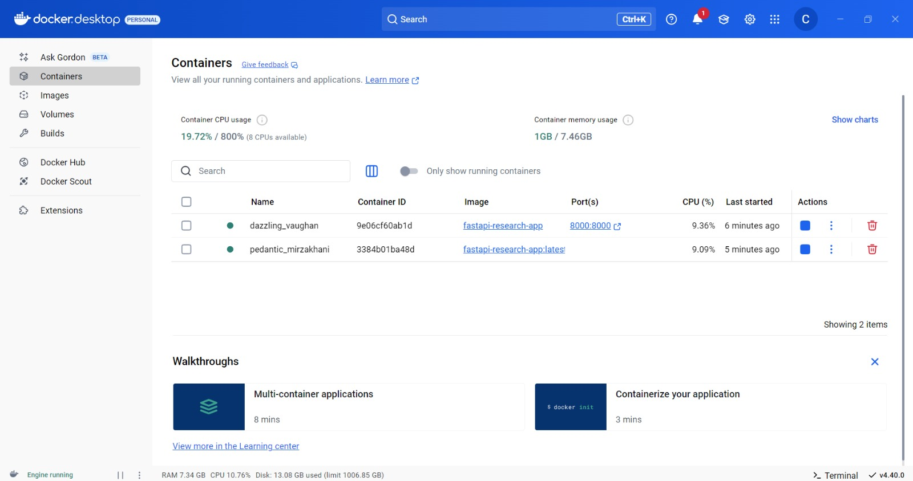
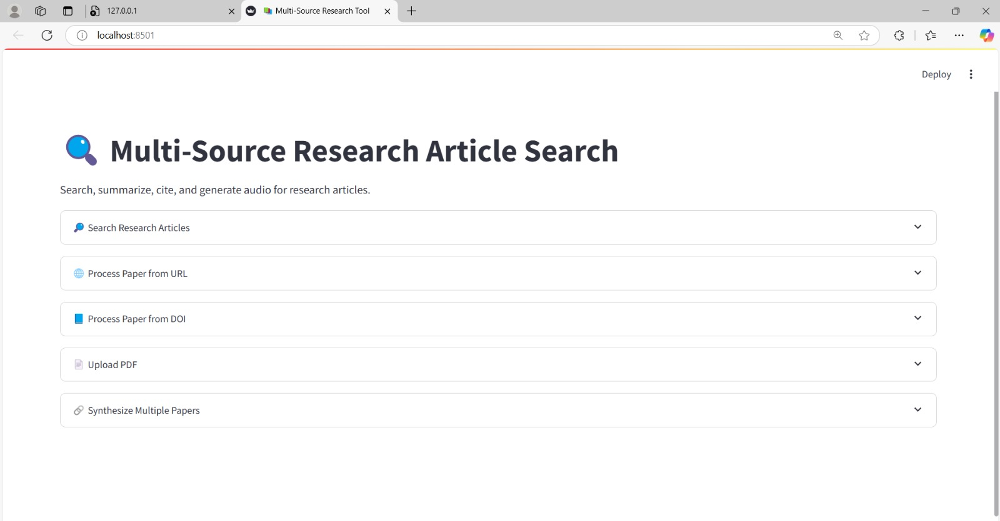
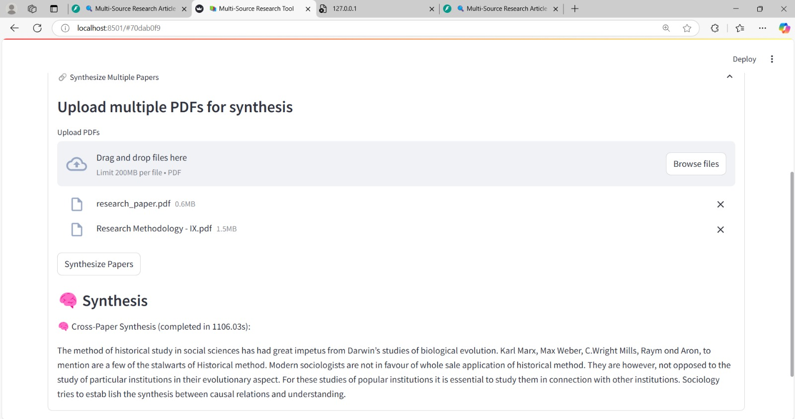
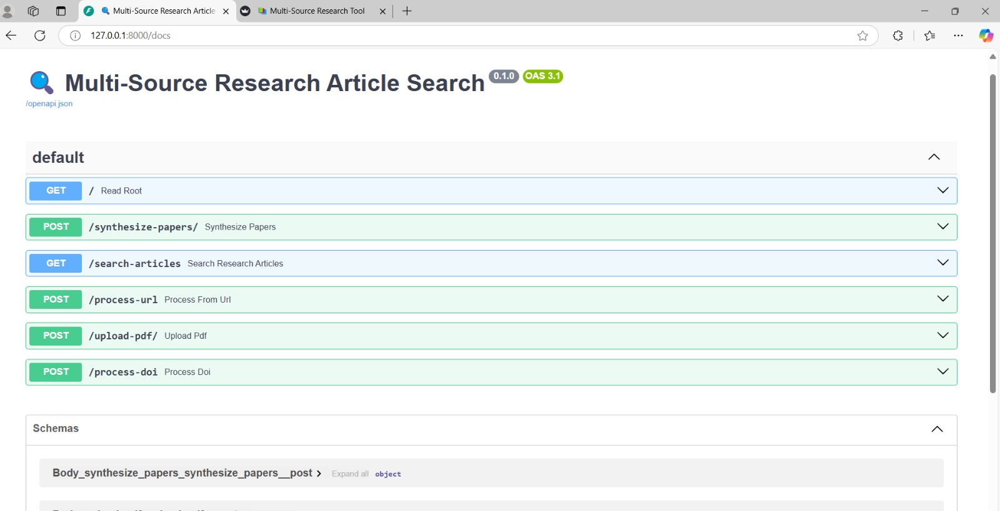
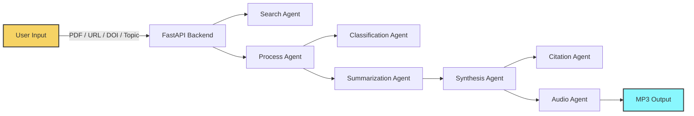

# 🧠 Research Paper Multi-Agent System

A multi-agent system to **automate research workflows** — from searching academic papers to generating summaries, synthesizing insights, generating citations, and converting outputs into **audio podcasts**.

This system uses **FastAPI** and **Celery** for backend orchestration, **Streamlit** as the frontend, and various NLP models (TF-IDF, Sentence-BERT, Transformers) for classification and summarization. It is also fully Dockerized for seamless deployment.

---

## 🔧 Agents Used

| Agent | Description |
|-------|-------------|
| 🔍 `search_agent.py` | Searches relevant papers via keywords or topic queries |
| 📄 `process_agent.py` | Extracts and cleans content from PDFs, URLs, or DOIs |
| 🧠 `classify_agent.py` | Classifies papers using TF-IDF + Naive Bayes and Sentence-BERT |
| 📝 `summarize_agent.py` | Summarizes papers using Hugging Face Transformer models |
| 🧬 `synthesize_agent.py` | Synthesizes multiple summaries into a unified output |
| 🔗 `citation_agent.py` | Generates citations in APA/MLA/IEEE formats |
| 🔊 `audio_agent.py` | Converts final output into audio using TTS (Hugging Face) |

---

## Images:






## 🧱 Project Structure

```
research-paper-multi-agent/
├── app.py                 # FastAPI application
├── celery_worker.py       # Celery task queue
├── streamlit_app.py       # Streamlit UI frontend
│
├── agents/
│   ├── search_agent.py
│   ├── process_agent.py
│   ├── classify_agent.py
│   ├── summarize_agent.py
│   ├── synthesize_agent.py
│   ├── citation_agent.py
│   └── audio_agent.py
│
├── uploads/               # Uploaded PDFs
├── summaries/             # Generated summaries
├── audio/                 # Podcast outputs
├── helpers/               # Utility functions
│   └── helpers.py
│
├── Dockerfile
├── docker-compose.yml
├── requirements.txt
└── README.md
```

---

## 🧠 Models Used

### 🔹 Classification
- `TF-IDF` + `Naive Bayes`: Lightweight topic classification
- `Sentence-BERT` (`all-MiniLM-L6-v2`): Semantic similarity for multi-label classification

### 🔹 Summarization
- `facebook/bart-large-cnn`: Abstractive summarization model from Hugging Face Transformers
- Optional: `google/pegasus-xsum`

### 🔹 Audio Generation
- `tts_models/en/ljspeech/tacotron2-DDC`: Hugging Face TTS model for converting text to podcast format

---

## 🏗️ System Architecture



---

## 📚 Methodology

### 🔬 1. Input Modes
- Users upload a **PDF**, enter a **URL**, a **DOI**, or **custom topic**
- Content extracted via `PyMuPDF`, `BeautifulSoup`, or APIs like `Crossref` and `Unpaywall`

### 🧠 2. Classification
- TF-IDF + Naive Bayes for quick tagging
- Sentence-BERT for semantic topic detection

### 📝 3. Summarization
- Extractive + Abstractive pipelines
- BART or Pegasus models from Hugging Face

### 🔗 4. Citation Generation
- Parses references or uses metadata
- Supports APA, MLA, and IEEE formats

### 🎙️ 5. Audio Synthesis
- Final summary passed to a TTS model
- Generates podcast-style `.mp3` audio

---

## 💻 Local Installation

```bash
# 1. Clone repo
git clone https://github.com/your-username/research-paper-multi-agent.git
cd research-paper-multi-agent

# 2. Create & activate virtual environment
python -m venv venv
source venv/bin/activate  # Windows: venv\Scripts\activate

# 3. Install dependencies
pip install -r requirements.txt

# 4. Start services
uvicorn app:app --reload
celery -A celery_worker.celery worker --loglevel=info
streamlit run streamlit_app.py
```

---

## 🐳 Docker Installation

### 1. Build & Run

```bash
docker-compose up --build
```

### 2. Access:
- FastAPI API: [http://localhost:8000/docs](http://localhost:8000/docs)
- Streamlit UI: [http://localhost:8501](http://localhost:8501)

---

## 📦 Docker Compose Overview

```yaml
version: '3'
services:
  api:
    build: .
    command: uvicorn app:app --host 0.0.0.0 --port 8000 --reload
    ports:
      - "8000:8000"
    volumes:
      - .:/code
  streamlit:
    build: .
    command: streamlit run streamlit_app.py
    ports:
      - "8501:8501"
    depends_on:
      - api
  celery:
    build: .
    command: celery -A celery_worker.celery worker --loglevel=info
    depends_on:
      - api
```

---

## 🌟 Use Cases

- Automated research summarization & synthesis
- Literature review generator
- Educational research tool
- Research podcast automation

---


## ⚠️ Limitations

- Model performance may degrade on low-quality scans or noisy documents
- Citation extraction may fail on malformed metadata
- Summarization is limited to Hugging Face model constraints (e.g., 1024 tokens)
- No GPU acceleration enabled by default in Docker setup

---

## 🚀 Future Improvements

- Integrate real-time vector search (e.g., `Qdrant` or `Weaviate`) for paper retrieval
- Enable user feedback loops to improve summary quality
- Use Whisper or Bark for higher-fidelity audio synthesis
- Add RAG-based abstraction and distillation across papers
- Enhance UI with visualization and topic heatmaps

---

## 📄 License

MIT License © 2025 K.V. Chaitanya
